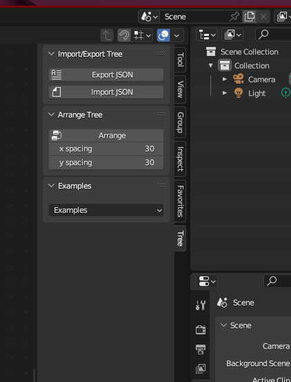
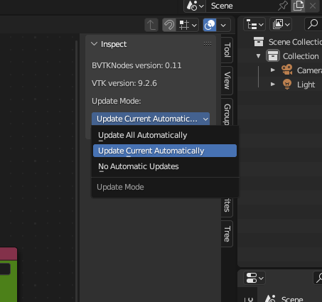
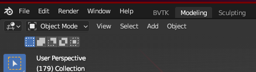
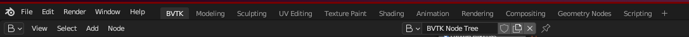
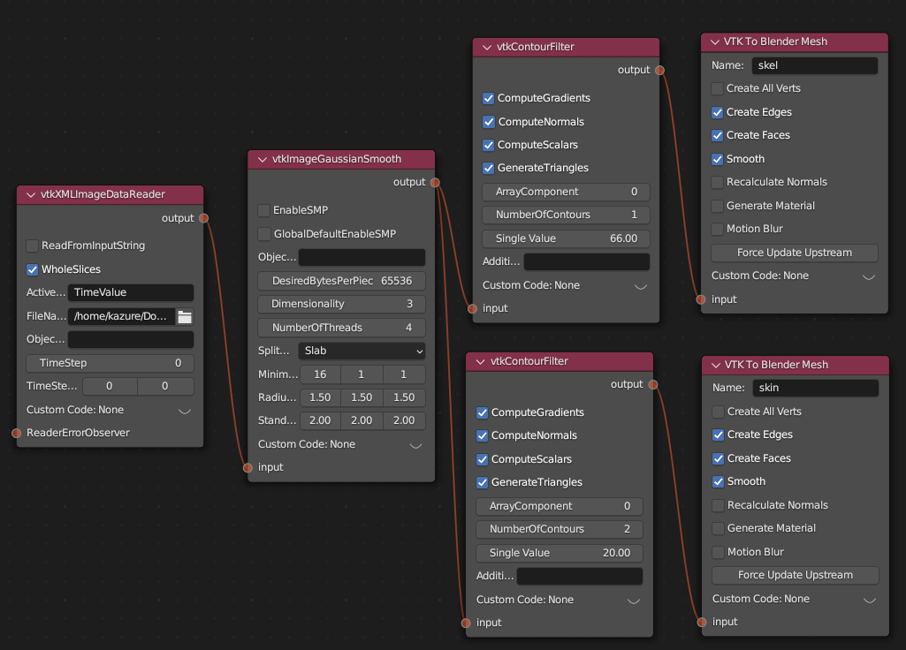

# BVtkNodes

[docs](./docs)

[learn from official](./docs/learn_tutorial.md)

[FAQ](./docs/FAQ.md)

## How to use 

**Preparations:**

1. Blender 3.6/4.2
2. Install VTK

*general:*

``` shell
/path/blender-X.Y/X.Y/python/bin/python3.Z -m pip install vtk==9.2.6
```

*install error with blender4.2 on windows:*

``` shell
& 'C:\Program Files\Blender Foundation\Blender\4.2\python\bin\python.exe' -m pip install vtk==9.2.6 --target 'C:\Program Files\Blender Foundation\Blender\4.2\python\lib\site-packages'
```

3. Install VTK and some Error on Linux and may be on windows. 

edit `path/blender-X.Y/X.Y/python/lib/pythonZ/site-packages/vtkmodules/all.py`,
like:
``` python
# from .vtkRenderingMatplotlib import *
```

And edit
`path/blender-X.Y/X.Y/python/lib/pythonZ/site-packages/vtk.py`,
like:
``` python
# from vtkmodules.vtkRenderingMatplotlib import *
```

4. [BVtkNodes](https://github.com/tkeskita/BVtkNodes)

- Download the BVTKNode repository add-on as a `.zip` file.
- Start Blender, go to `Edit` –> `Preferences` –> `Add-ons` –> `Install` –> open the add-on zip file.
- Activate the `BVTKNodes` add-on in Preferences by clicking on the checkbox. Add-on is located in Node category, “Community” level of Blender add-ons.

**Start to build:**

1. open `BVTK Node Tree`.


2. click the `new` at the top.


3. build nodes flow with nodes under the `add`. 


4. or import `JSON` file with `tree` tab on the right. 



5. finally, you will get things done like this.


**Run the flow:**

1. you need to change the `Update Mode` to `Update All Automatically` 
in the `Inspect` tab.



2. you need to choose the correct file path in your computer,
in the `FileName` of `vtkPolyDataReader` node. 
(you can choose random `vtk` file)


3. switch to `Modeling` on the top. 



4. press `z` to call out the `Shading Mode` panel.
Then choose `Rendered` or `Material Preview`.


5. finally you can press `space` to start. 

**Export:**

1. switch to `Rendering` at the top. 



2. click the `output` bottom with a printer icon on the right.


3. modify the configuration, output path and file format. 
4. click the `Render` on the left top, then click the `Render Animation`.


**Example:**

> you can get the example data [here](https://1drv.ms/f/c/de361a567b1f3a6e/EuzUGDrGuQtHhkPXGU46B0sBTIaD2zBASL5JHKP4NBtMVA?e=ZhCpTe)

Blow is an example video:

[](https://www.youtube.com/watch?v=qHN721bcZJ0)

## TODO

## Source

Here is the source [repo](https://github.com/tkeskita/BVtkNodes).

## The Official Tutorial

1. `Shift+F3` twice: open the layout and create a new one.
The old one is the official template, so we can not find the node about vtk. 
2. `Shift+A` to add a new node. 
The official tutorial provide a vti file. 

### The node procedure

- vtkXMLImageDataReader
  - vtkImageGaussianSmooth
    - vtkContourFilter: Single Value=66
      - VTK To Blender Mesh: Name=skel; checkout Smooth
    - vtkContourFilter: Single Value: 20
      - VTK To Blender Mesh: Name=skin; ckeckout Smooth
