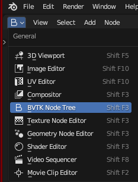
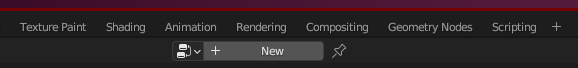
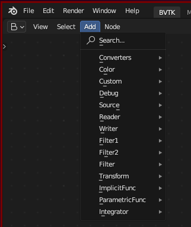
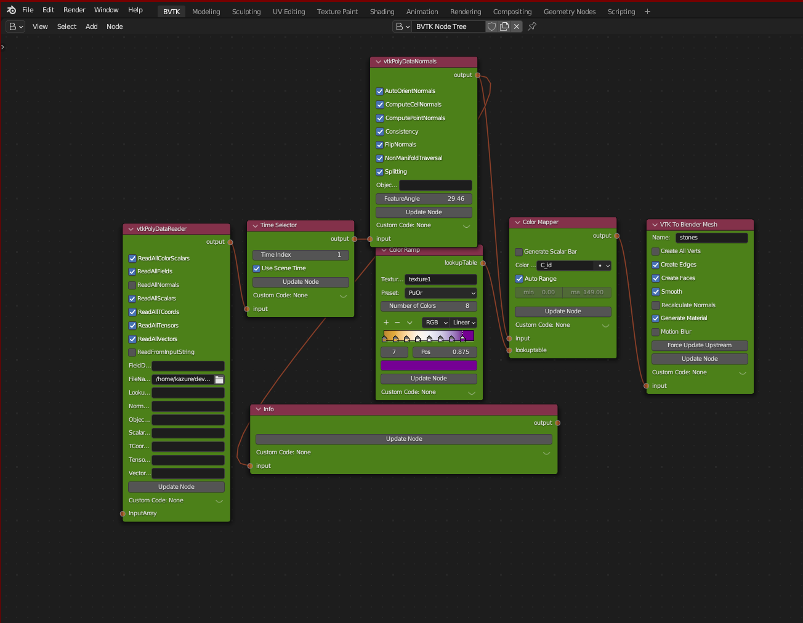
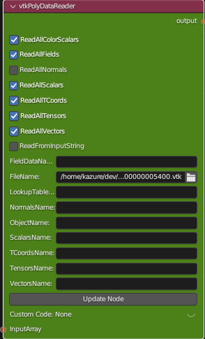
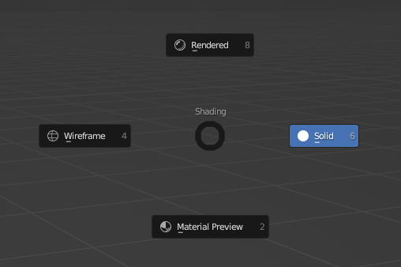
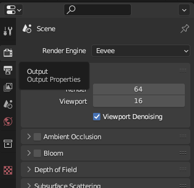
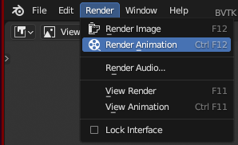

# BVtkNodes

[docs](./docs)

[learn from official](./docs/learn_tutorial.md)

## How to use 

**Preparations:**

1. Blender 3.6

2. [BVtkNodes](https://github.com/tkeskita/BVtkNodes)

**Start to build:**

1. open `BVTK Node Tree`.

2. click the `new` at the top.

3. build nodes flow with nodes under the `add`. 

or import `JSON` file with `tree` tab on the right. 

4. finally, you will get things done like this.

**Run the flow:**

> remember to delete the cube generated default. 

1. you need to change the `Update Mode` to `Update All Automatically` 
in the `Inspect` tab.

2. you need to choose the correct file path in your computer,
in the `FileName` of `vtkPolyDataReader` node. 
(you can choose random `vtk` file)

3. switch to `Modeling` on the top. 

4. press `z` to call out the `Shading Mode` panel.
Then choose `Rendered` or `Material Preview`.

5. finally you can press `space` to start. 

**Export:**

1. switch to `Rendering` at the top. 

2. click the `output` bottom with a printer icon on the right.

3. modify the configuration, output path and file format. 

4. click the `Render` on the left top, then click the `Render Animation`.

## TODO

## Source

Here is the source [repo](https://github.com/tkeskita/BVtkNodes).

## The Official Tutorial

1. `Shift+F3` twice: open the layout and create a new one.
The old one is the official template, so we can not find the node about vtk. 
2. `Shift+A` to add a new node. 
The official tutorial provide a vti file. 
you can get from [here](./data/head.vti)

### The node procedure

- vtkXMLImageDataReader
  - vtkImageGaussianSmooth
    - vtkContourFilter: Single Value=66
      - VTK To Blender Mesh: Name=skel; checkout Smooth
    - vtkContourFilter: Single Value: 20
      - VTK To Blender Mesh: Name=skin; ckeckout Smooth
